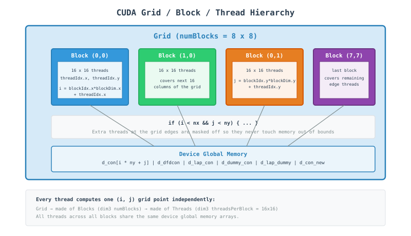
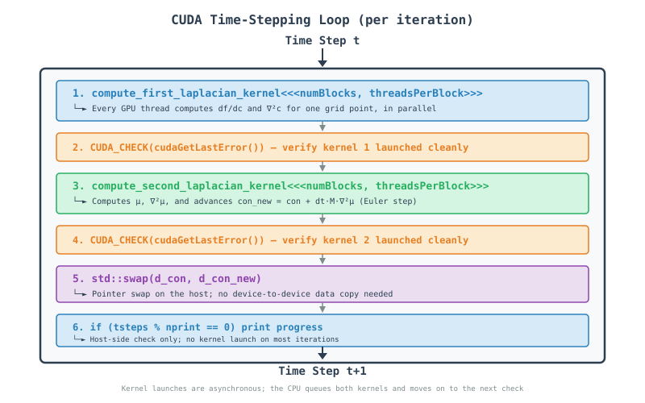

# CUDA Finite Difference Phase Field Code - A Tutorial Guide

## Table of Contents
1. [Introduction](#introduction)
2. [Understanding the Physics](#understanding-the-physics)
3. [CUDA Concepts for Beginners](#cuda-concepts-for-beginners)
4. [Step-by-Step Code Walkthrough](#step-by-step-code-walkthrough)
5. [Visualization of Parallel Execution](#visualization-of-parallel-execution)
6. [Performance Optimization](#performance-optimization)
7. [Running the Code](#running-the-code)
8. [Common Pitfalls and Solutions](#common-pitfalls-and-solutions)
9. [Advanced Topics](#advanced-topics)
10. [Appendix: Quick Reference](#appendix-quick-reference)

---

## Introduction
This document provides a comprehensive tutorial on parallel computing using CUDA (Compute Unified Device Architecture) through a finite difference code that solves the Cahn-Hilliard equation—a fundamental model for phase separation in materials science. The code demonstrates how to take a serial computational problem and parallelize it across thousands of lightweight threads on a GPU.

### What You Will Learn
* How to write and launch CUDA kernels
* The grid / block / thread execution model
* Managing separate host (CPU) and device (GPU) memory
* Data management with flattened 1D arrays on the device
* Performance optimization techniques for GPU computing

---

## Understanding the Physics
The Cahn-Hilliard equation describes phase separation in binary alloys:

$$\frac{\partial c}{\partial t} = \nabla \cdot \left[M \nabla \left(\frac{\delta F}{\delta c}\right)\right]$$

where:
* **$c$**: Concentration field
* **$M$**: Mobility
* **$F$**: Free energy functional

The code uses a 5-point finite difference stencil to discretize this equation spatially:

$$\nabla^2 c = \frac{c[i+1,j] + c[i-1,j] + c[i,j+1] + c[i,j-1] - 4c[i,j]}{\Delta x \cdot \Delta y}$$

### Why Parallelize with CUDA?
The 2D domain is $128 \times 128$ grid points, evolved for $5000$ time steps. For larger, realistic simulations:
* **Serial:** every grid point updated one at a time on the CPU — **too slow** to scale to fine grids or long runs.
* **CUDA Parallel:** one GPU thread is assigned to each grid point; thousands of points are updated **at the same instant**, in a single kernel launch.

---

## CUDA Concepts for Beginners
### What is CUDA?
CUDA is NVIDIA's platform for writing programs that run on the GPU. Instead of a handful of CPU cores, a GPU offers thousands of small, simple cores. CUDA lets you write a function called a **kernel** that a huge number of threads execute simultaneously, each working on its own piece of data.

### Key Concepts

| Concept | Analogy | In Our Code |
| :--- | :--- | :--- |
| **Thread** | One assembly-line worker | Handles a single grid point `(i, j)` |
| **Block** | A team of workers | A `16 x 16` tile of threads (`threadsPerBlock`) |
| **Grid** | The whole factory floor | All blocks needed to cover the `128 x 128` domain (`numBlocks`) |
| **Kernel** | The job instructions handed to every worker | `__global__` functions like `compute_first_laplacian_kernel` |
| **Host / Device** | The office vs. the factory floor | CPU (`h_` arrays) vs. GPU (`d_` arrays) |

### Grid / Block / Thread Execution Model

<!-- In HTML -->


## Step-by-Step Code Walkthrough

### Step 1: Include CUDA and Standard Headers

```cpp
#include <iostream>
#include <fstream>
#include <random>
#include <chrono>
#include <cmath>
#include <vector>
#include <algorithm>
#include <iomanip>
#include <cuda_runtime.h>

using namespace std::chrono;
```

#### What happens here?
*   `<cuda_runtime.h>`: CUDA runtime API header — declares `cudaMalloc`, `cudaMemcpy`, kernel launch syntax, and error-handling functions.
*   The other headers are standard C++: file output (`ch.dat`), random noise generation, timing, and formatted printing.
*   `using namespace std::chrono` lets the code call `high_resolution_clock::now()` without the `std::chrono::` prefix.

### Step 2: Physical and Simulation Parameters

```cpp
constexpr int Nx = 128;
constexpr int Ny = 128;
constexpr double dx = 1.0;
constexpr double dy = 1.0;

constexpr int nsteps = 5000;
constexpr int nprint = 1000;
constexpr double dt = 0.01;

constexpr double con_0 = 0.4;
constexpr double mobility = 1.0;
constexpr double grad_coef = 0.5;

constexpr double noise = 0.02;
constexpr double A = 1.0;
```

#### Important Points:
*   `Nx = Ny = 128`: 16,384 grid points total — small enough to fit in a handful of thread blocks.
*   `nsteps = 5000`, `nprint = 1000`: run 5000 time steps, printing progress every 1000.
*   `con_0`, `mobility`, `grad_coef`, `noise`, `A`: the same material/physics constants used in the MPI and OpenMP versions.

### Step 3: CUDA Error Checking Macro

```cpp
#define CUDA_CHECK(call) \
    do { \
        cudaError_t err = call; \
        if (err != cudaSuccess) { \
            std::cerr << "CUDA error in " << __FILE__ << " line " << __LINE__ \
                      << ": " << cudaGetErrorString(err) << std::endl; \
            exit(EXIT_FAILURE); \
        } \
    } while(0)
```

#### What happens here?
*   `do { ... } while(0)`: makes the macro behave like a single statement, even followed by a semicolon.
*   `cudaError_t err = call`: runs the CUDA call and captures its return code.
*   `cudaGetErrorString(err)`: converts the error code into a human-readable message.
*   Wrapping every CUDA call in `CUDA_CHECK(...)` is standard practice — GPU errors otherwise fail silently.

### Step 4: Kernel 1 - Free Energy Derivative and First Laplacian

```cpp
__global__ void compute_first_laplacian_kernel(
    const double* con,
    double* dfdcon,
    double* lap_con,
    int nx, int ny,
    double dx, double dy,
    double A_val, double grad_coef_val)
{
    int i = blockIdx.x * blockDim.x + threadIdx.x;
    int j = blockIdx.y * blockDim.y + threadIdx.y;

    if (i < nx && j < ny) {
        int ip = (i + 1) % nx;
        int im = (i - 1 + nx) % nx;
        int jp = (j + 1) % ny;
        int jm = (j - 1 + ny) % ny;

        double c = con[i * ny + j];

        dfdcon[i * ny + j] = A_val * (2.0 * c * (1.0 - c) * (1.0 - c) -
                                      2.0 * c * c * (1.0 - c));

        lap_con[i * ny + j] = (con[ip * ny + j] + con[im * ny + j] +
                               con[i * ny + jp] + con[i * ny + jm] -
                               4.0 * c) / (dx * dy);
    }
}
```

#### What happens here?
*   `__global__`: marks this as a kernel — it runs on the GPU and is launched from the CPU.
*   `blockIdx`, `blockDim`, `threadIdx`: built-in CUDA variables that let each thread compute its own unique `(i, j)` grid coordinate.
*   `if (i < nx && j < ny)`: boundary check — since the grid isn't always an exact multiple of the block size, some threads at the edges have no valid grid point and simply do nothing.
*   `ip`, `im`, `jp`, `jm`: periodic boundary neighbors, computed with modulo arithmetic (wrap-around), the same idea as the MPI and OpenMP versions.
*   `con[i * ny + j]`: 1D flattened indexing — CUDA device arrays are allocated as flat `double*` buffers, so a 2D index is mapped with `row * columns + column`.
*   `dfdcon[...]`: derivative of the double-well free energy $f(c) = Ac^2(1-c)^2$, driving separation into $c \approx 0$ and $c \approx 1$ phases.
*   `lap_con[...]`: the 5-point Laplacian stencil, computed independently by every thread with no communication needed.

### Step 5: Kernel 2 - Chemical Potential and Time Integration

```cpp
__global__ void compute_second_laplacian_kernel(
    const double* con,
    const double* dfdcon,
    const double* lap_con,
    double* dummy_con,
    double* lap_dummy,
    double* con_new,
    int nx, int ny,
    double dx, double dy,
    double grad_coef_val,
    double dt_val, double mobility_val)
{
    int i = blockIdx.x * blockDim.x + threadIdx.x;
    int j = blockIdx.y * blockDim.y + threadIdx.y;

    if (i < nx && j < ny) {
        int ip = (i + 1) % nx;
        int im = (i - 1 + nx) % nx;
        int jp = (j + 1) % ny;
        int jm = (j - 1 + ny) % ny;

        dummy_con[i * ny + j] = dfdcon[i * ny + j] - grad_coef_val * lap_con[i * ny + j];

        lap_dummy[i * ny + j] = (dummy_con[ip * ny + j] + dummy_con[im * ny + j] +
                                 dummy_con[i * ny + jp] + dummy_con[i * ny + jm] -
                                 4.0 * dummy_con[i * ny + j]) / (dx * dy);

        double new_val = con[i * ny + j] + dt_val * mobility_val * lap_dummy[i * ny + j];
        con_new[i * ny + j] = fmax(0.00001, fmin(0.99999, new_val));
    }
}
```

#### Why a second kernel?
*   `dummy_con`: the chemical potential $\mu = \frac{\partial f}{\partial c} - \kappa \nabla^2 c$, needed before it can itself be differentiated.
*   `lap_dummy`: $\nabla^2 \mu$, computed with the same 5-point stencil, now on the chemical potential field.
*   `con_new[...] = con + dt \cdot M \cdot \nabla^2 \mu$: explicit forward-Euler time step, clamped with `fmax`/`fmin` to keep the concentration physically bounded between `0.00001` and `0.99999`.
*   The two kernels are separate because `lap_dummy` depends on `dummy_con` values from *neighboring* threads — every thread must finish writing `dummy_con` before any thread reads its neighbors' values, and a kernel launch is the simplest way to guarantee that synchronization across the whole grid.

### Step 6: Host Output Function

```cpp
void output_concentration_on_file(const double* con, int nx, int ny, const std::string& filename = "ch.dat") {
    std::ofstream outfile(filename);

    if (!outfile.is_open()) {
        std::cerr << "Error opening file: " << filename << std::endl;
        return;
    }

    outfile << std::fixed << std::setprecision(6);
    for (int i = 0; i < nx; ++i) {
        for (int j = 0; j < ny; ++j) {
            outfile << con[i * ny + j] << (j < ny - 1 ? " " : "");
        }
        outfile << "\n";
    }

    outfile.close();
    std::cout << "Results written to: " << filename << std::endl;
}
```

#### Important Points:
*   This is a plain host (CPU) function — no `__global__` keyword, so it runs only on the CPU, after results are copied back from the GPU.
*   `std::setprecision(6)`: writes 6 digits after the decimal point in fixed-point notation.
*   The ternary `(j < ny - 1 ? " " : "")` separates values with spaces but avoids a trailing space at the end of each row.

### Step 7: Host Memory Allocation and Initialization

```cpp
size_t N = Nx * Ny;
size_t bytes = N * sizeof(double);

double* h_con = new double[N];
double* h_con_new = new double[N];
double* h_dfdcon = new double[N];
double* h_lap_con = new double[N];
double* h_dummy_con = new double[N];
double* h_lap_dummy = new double[N];

std::mt19937 rng(12345);
std::uniform_real_distribution<double> dist(0.0, 1.0);

for (int i = 0; i < Nx; ++i) {
    for (int j = 0; j < Ny; ++j) {
        double r = dist(rng);
        h_con[i * Ny + j] = con_0 + noise * (0.5 - r);
    }
}
```

#### Important Points:
*   `h_` prefix denotes host (CPU) memory, allocated with plain `new[]` as flat arrays.
*   `std::mt19937 rng(12345)`: a fixed seed, so every run produces the same initial noise — useful for reproducibility (unlike the MPI version, there is only one process, so no per-rank seed offset is needed).
*   Initialization runs serially on the CPU before anything is sent to the GPU.

### Step 8: Device Memory Allocation and Host-to-Device Copy

```cpp
double* d_con;
double* d_con_new;
double* d_dfdcon;
double* d_lap_con;
double* d_dummy_con;
double* d_lap_dummy;

CUDA_CHECK(cudaMalloc(&d_con, bytes));
CUDA_CHECK(cudaMalloc(&d_con_new, bytes));
CUDA_CHECK(cudaMalloc(&d_dfdcon, bytes));
CUDA_CHECK(cudaMalloc(&d_lap_con, bytes));
CUDA_CHECK(cudaMalloc(&d_dummy_con, bytes));
CUDA_CHECK(cudaMalloc(&d_lap_dummy, bytes));

CUDA_CHECK(cudaMemcpy(d_con, h_con, bytes, cudaMemcpyHostToDevice));
```

#### Important Points:
*   `d_` prefix denotes device (GPU) memory — a completely separate address space from the host.
*   `cudaMalloc(&d_con, bytes)`: allocates `bytes` of GPU global memory and stores the resulting pointer in `d_con`.
*   `cudaMemcpy(..., cudaMemcpyHostToDevice)`: only the initial concentration field needs to be uploaded — the other five arrays are computed entirely on the GPU.

### Step 9: Kernel Launch Configuration

```cpp
dim3 threadsPerBlock(16, 16);
dim3 numBlocks((Nx + threadsPerBlock.x - 1) / threadsPerBlock.x,
               (Ny + threadsPerBlock.y - 1) / threadsPerBlock.y);
```

#### Important Points:
*   `dim3`: CUDA's built-in 3-component (x, y, z) dimension type.
*   `threadsPerBlock(16, 16)`: 256 threads per block, a typical size for 2D stencil problems.
*   `numBlocks`: computed with ceiling division so the grid of blocks fully covers `Nx x Ny`, even when it doesn't divide evenly — e.g. `(128 + 16 - 1) / 16 = 8` blocks per dimension here.

### Step 10: The Evolution Loop

```cpp
for (int tsteps = 1; tsteps <= nsteps; tsteps++) {
    compute_first_laplacian_kernel<<<numBlocks, threadsPerBlock>>>(
        d_con, d_dfdcon, d_lap_con,
        Nx, Ny, dx, dy, A, grad_coef);
    CUDA_CHECK(cudaGetLastError());

    compute_second_laplacian_kernel<<<numBlocks, threadsPerBlock>>>(
        d_con, d_dfdcon, d_lap_con,
        d_dummy_con, d_lap_dummy, d_con_new,
        Nx, Ny, dx, dy, grad_coef, dt, mobility);
    CUDA_CHECK(cudaGetLastError());

    std::swap(d_con, d_con_new);

    if (tsteps % nprint == 0) {
        std::cout << "Done steps = " << tsteps << std::endl;
    }
}
```

#### What happens here?
*   `kernel<<<numBlocks, threadsPerBlock>>>(...)`: the triple angle-bracket syntax launches the kernel across the whole grid — this line hands work to the GPU and returns immediately (asynchronous launch).
*   `CUDA_CHECK(cudaGetLastError())`: checks for launch-configuration errors right after each kernel call, since kernel launches don't return an error code directly.
*   `std::swap(d_con, d_con_new)`: swaps the two *device pointers* on the host side — an O(1) operation with no GPU memory copy involved, exactly like the pointer swap in the MPI and OpenMP versions.
*   The second kernel implicitly waits for the first to finish, because both are issued on the GPU's default stream, which executes kernels in the order they were launched.

### Step 11: Final Data Transfer and Cleanup

```cpp
CUDA_CHECK(cudaMemcpy(h_con, d_con, bytes, cudaMemcpyDeviceToHost));

auto end_time = high_resolution_clock::now();
auto duration = duration_cast<milliseconds>(end_time - start_time);

std::cout << "  Time       = " << duration.count() / 1000.0 << " seconds." << std::endl;

output_concentration_on_file(h_con, Nx, Ny);

CUDA_CHECK(cudaFree(d_con));
CUDA_CHECK(cudaFree(d_con_new));
CUDA_CHECK(cudaFree(d_dfdcon));
CUDA_CHECK(cudaFree(d_lap_con));
CUDA_CHECK(cudaFree(d_dummy_con));
CUDA_CHECK(cudaFree(d_lap_dummy));

delete[] h_con;
delete[] h_con_new;
delete[] h_dfdcon;
delete[] h_lap_con;
delete[] h_dummy_con;
delete[] h_lap_dummy;

return EXIT_SUCCESS;
```

#### Important Points:
*   `cudaMemcpy(..., cudaMemcpyDeviceToHost)`: copies the final concentration field back to CPU memory so it can be written to `ch.dat`.
*   `cudaFree(...)`: releases GPU memory — every `cudaMalloc` needs a matching `cudaFree`.
*   `delete[] h_...`: releases the corresponding CPU memory — every `new[]` needs a matching `delete[]`.
*   Skipping either kind of cleanup leaks memory on the host or the device, respectively.

---

## Visualization of Parallel Execution

### Per-Timestep Kernel Flow:

<!-- In HTML -->


---

## Performance Optimization

### Memory Coalescing

#### Why indexing order matters:
GPU memory bandwidth is much higher when neighboring threads read/write neighboring memory addresses in the same instruction — this is called a **coalesced** access.

```cpp
// con[i * ny + j] with j varying fastest across threadIdx.x
// is well-coalesced when threads are laid out along x = j
```

*   `blockDim(16, 16)` maps `threadIdx.x` to consecutive `j` values when the array is indexed `i * ny + j`.
*   Threads in the same warp (32 consecutive threads) should touch consecutive addresses — this code's flattened row-major layout supports that.

### Occupancy and Block Size

| Block Size | Threads/Block | Trade-off |
| :--- | :--- | :--- |
| `8 x 8` | 64 | More blocks, more scheduling overhead |
| `16 x 16` | 256 | Good default for 2D stencils (used here) |
| `32 x 32` | 1024 | Maximum threads/block on most GPUs; can limit occupancy from register/shared-memory pressure |

#### Example: trying a different block size
```cpp
dim3 threadsPerBlock(32, 8);   // 256 threads, different aspect ratio
dim3 numBlocks((Nx + threadsPerBlock.x - 1) / threadsPerBlock.x,
               (Ny + threadsPerBlock.y - 1) / threadsPerBlock.y);
```

### Reducing Kernel Launch Overhead

*   Each kernel launch has a small fixed overhead (a few microseconds).
*   With `nsteps = 5000` and 2 kernels per step, this code issues 10,000 launches — negligible individually, but worth knowing about if `Nx`/`Ny` were much smaller.
*   Fusing both kernels into one would remove one launch per step, at the cost of needing an explicit device-wide synchronization (e.g. a grid-wide barrier via cooperative groups) partway through, since `lap_dummy` depends on every thread's `dummy_con` write completing first.

### Asynchronous Execution

```cpp
compute_first_laplacian_kernel<<<numBlocks, threadsPerBlock>>>(...);
CUDA_CHECK(cudaGetLastError());   // Only checks the launch, not completion
```

*   Kernel launches return to the CPU immediately; the GPU executes in the background.
*   The default stream serializes kernel 1 → kernel 2 → the next iteration's kernel 1, so results stay correct without extra synchronization calls in this code.
*   `cudaMemcpy` (without `Async`) does block until the copy completes, which is why it's safe to read `h_con` right after the final copy.

---

## Running the Code

### Compilation

Using the NVIDIA CUDA compiler:

```bash
nvcc -std=c++17 -o main main.cu
```

### Running

**Basic Run:**
```bash
./main
```

### Performance Monitoring

#### Using NVIDIA tools:
```bash
# Profile kernel execution and memory transfers
nsys profile ./main

# Detailed kernel-level metrics (occupancy, memory throughput)
ncu ./main

# Quick GPU utilization check while running
nvidia-smi
```

#### Output Interpretation:
```
Done steps = 1000
Done steps = 2000
Done steps = 3000
Done steps = 4000
Done steps = 5000
---------------------------------
  Time       = 4.128 seconds.
---------------------------------
Results written to: ch.dat
```

---

## Common Pitfalls and Solutions

### 1. Forgetting to Check Kernel Launch Errors

**Problem:**
```cpp
compute_first_laplacian_kernel<<<numBlocks, threadsPerBlock>>>(...);
// No error check — a bad launch configuration fails silently
```

**Solution:**
```cpp
compute_first_laplacian_kernel<<<numBlocks, threadsPerBlock>>>(...);
CUDA_CHECK(cudaGetLastError());  // Catches launch-time errors immediately
```

### 2. Out-of-Bounds Threads

**Problem:**
```cpp
int i = blockIdx.x * blockDim.x + threadIdx.x;
int j = blockIdx.y * blockDim.y + threadIdx.y;
con[i * ny + j] = 0.0;   // No bounds check — writes past the array when nx isn't a multiple of blockDim
```

**Solution:**
```cpp
if (i < nx && j < ny) {
    con[i * ny + j] = 0.0;   // Safe: extra edge threads simply do nothing
}
```

### 3. Mismatched Host/Device Pointers

**Problem:**
```cpp
double* d_con;
compute_first_laplacian_kernel<<<...>>>(h_con, ...);  // Passing a host pointer to a kernel!
```

**Solution:**
```cpp
// Always pass device pointers (the d_ prefixed ones) to kernels
compute_first_laplacian_kernel<<<...>>>(d_con, ...);
```
Dereferencing a host pointer on the GPU (or vice versa) causes a crash or silent corruption — CUDA does not check this for you.

### 4. Leaking GPU Memory

**Problem:** Allocating with `cudaMalloc` but never calling `cudaFree`.

**Solution:** Match every allocation with a matching free, ideally with `CUDA_CHECK` around both:
```cpp
CUDA_CHECK(cudaMalloc(&d_con, bytes));
// ... use d_con ...
CUDA_CHECK(cudaFree(d_con));
```

### 5. Race Conditions Between Kernels

**Problem:** Reading a neighbor's value before it has been written for the current step.

**Solution:** Split the computation into separate kernel launches (as this code does) — the CUDA runtime guarantees kernel *B* only starts after kernel *A* completes on the same stream, giving you a free synchronization point between the "write" and "read neighbors" phases.

---

## Advanced Topics

### Shared Memory Tiling

Threads in the same block can cooperate through fast on-chip shared memory instead of repeatedly hitting global memory:

```cpp
__shared__ double tile[18][18];  // 16x16 block + 1-cell halo on each side
// Load tile cooperatively, __syncthreads(), then compute the stencil from the tile
```

### CUDA Streams

For overlapping computation with data transfer, or running independent kernels concurrently:

```cpp
cudaStream_t stream1, stream2;
cudaStreamCreate(&stream1);
cudaStreamCreate(&stream2);

kernelA<<<blocks, threads, 0, stream1>>>(...);
kernelB<<<blocks, threads, 0, stream2>>>(...);
```

### Unified Memory

Simplifies host/device memory management at some performance cost:

```cpp
double* con;
cudaMallocManaged(&con, bytes);  // Accessible from both host and device
// No explicit cudaMemcpy needed — the driver migrates pages automatically
```

### Multi-GPU with CUDA + MPI

Combine with MPI for cluster-level, multi-GPU parallelism:

```cpp
MPI_Init(&argc, &argv);
int rank;
MPI_Comm_rank(MPI_COMM_WORLD, &rank);

cudaSetDevice(rank % num_gpus_per_node);
compute_first_laplacian_kernel<<<numBlocks, threadsPerBlock>>>(...);

MPI_Finalize();
```

---

## Appendix: Quick Reference

### CUDA Keywords

| Keyword | Purpose |
| :--- | :--- |
| `__global__` | Function runs on GPU, callable from CPU (a kernel) |
| `__device__` | Function runs on GPU, callable only from GPU code |
| `__host__` | Function runs on CPU (the default) |
| `__shared__` | Variable stored in fast on-chip block-shared memory |
| `__syncthreads()` | Barrier synchronizing all threads within a block |

### Built-in Thread/Block Variables

| Variable | Purpose |
| :--- | :--- |
| `threadIdx.x/y/z` | Index of the thread within its block |
| `blockIdx.x/y/z` | Index of the block within the grid |
| `blockDim.x/y/z` | Number of threads per block |
| `gridDim.x/y/z` | Number of blocks per grid |

### Memory Management Functions

| Function | Purpose |
| :--- | :--- |
| `cudaMalloc(ptr, bytes)` | Allocate device (GPU) memory |
| `cudaFree(ptr)` | Free device memory |
| `cudaMemcpy(dst, src, bytes, dir)` | Copy memory (host↔device) |
| `cudaMemcpyHostToDevice` | Transfer direction: CPU → GPU |
| `cudaMemcpyDeviceToHost` | Transfer direction: GPU → CPU |
| `cudaMallocManaged(ptr, bytes)` | Allocate unified memory (host + device) |
| `cudaGetLastError()` | Retrieve the last kernel-launch error |
| `cudaGetErrorString(err)` | Convert an error code to a readable string |

### Kernel Launch Syntax

| Syntax | Purpose |
| :--- | :--- |
| `kernel<<<blocks, threads>>>(...)` | Launch a kernel across `blocks` x `threads` |
| `dim3 threadsPerBlock(16, 16)` | Define a 2D block shape |
| `dim3 numBlocks(nx, ny)` | Define the number of blocks in the grid |

---

```{toctree}
:maxdepth: 1
:caption: CUDA Topics