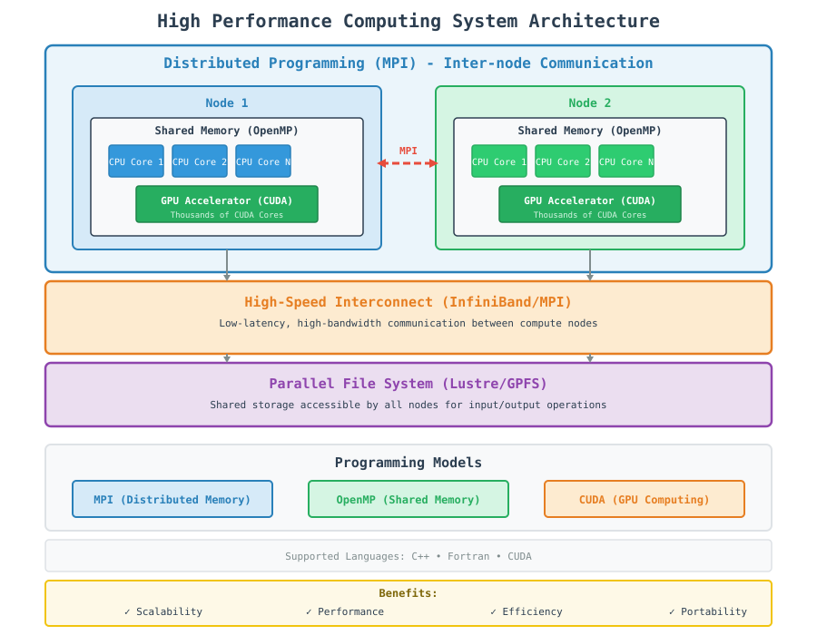

<style>H1{color:Black;}</style>

<style>H2{color:DarkOrange;}</style>

<style>p{color:Black;}</style>

# High Performance Computing

High Performance Computing (HPC) involves using powerful computing resources to solve complex scientific and engineering problems that are too large or computationally intensive for standard computers. HPC systems typically consist of thousands of computing nodes working together to achieve results faster than would be possible with a single computer.

## The HPC Landscape
Modern HPC systems leverage three primary programming models, each addressing different aspects of computational performance:

### 1. Distributed Programming (MPI)
Distributed programming uses the Message Passing Interface (MPI) to enable communication between multiple independent processes running on different compute nodes. Each process has its own memory space and communicates with others via messages over a network.

**Key characteristics:**

*   Multiple nodes connected via high-speed interconnects
*   Independent memory spaces
*   Communication via message passing
*   Scales to thousands of nodes
*   Languages: C++, Fortran

`Use Case:` Large-scale simulations requiring massive parallelism across many compute nodes.

### 2. Shared Memory Programming (OpenMP)
Shared memory programming allows multiple threads within a single process to access the same memory space. OpenMP provides a simple directive-based approach to parallelize loops and sections of code.

**Key characteristics:**

*   Single node with shared memory
*   Thread-level parallelism
*   Direct memory access
*   Easy to implement
*   Languages: C++, Fortran

`Use Case:` Node-level parallelism where data is shared among threads on a single compute node.

### 3. Heterogeneous Programming (GPU/CUDA)
Heterogeneous programming utilizes accelerators like GPUs alongside CPUs to perform massively parallel computations. CUDA (Compute Unified Device Architecture) enables developers to harness GPU computing power for data-parallel workloads.

**Key characteristics:**

CPU + GPU hybrid architecture

*   Massive parallelism (thousands of cores)
*   Data-parallel workloads
*   Memory management between host and device
*   Languages: C++, CUDA

`Use Case:` Highly parallel computations like matrix operations, machine learning, and scientific simulations.

## Hybrid HPC Approach
Modern HPC applications often combine all three models:

*   MPI for inter-node communication
*   OpenMP for intra-node parallelism
*   CUDA for GPU acceleration

## HPC System Architecture Overview
The diagram below illustrates the typical HPC system architecture:


<!-- In HTML -->



```{toctree}
:maxdepth: 1
:caption: HPC Programming Models

mpi/index
openmp/index
cuda/index