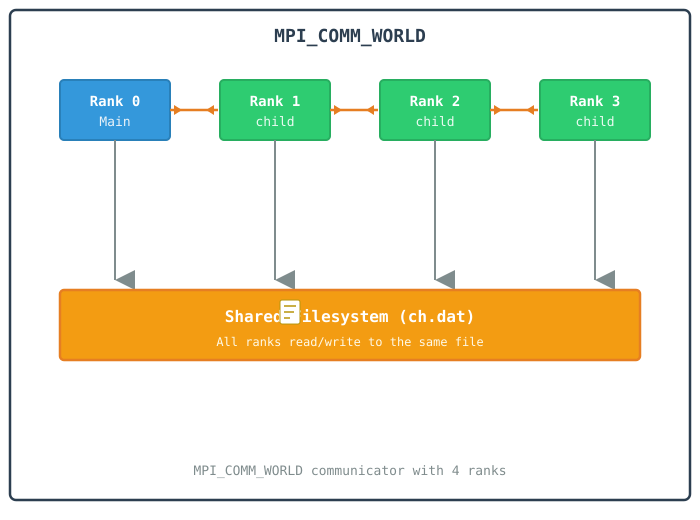
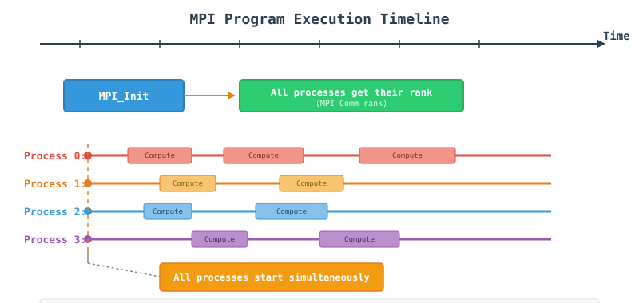
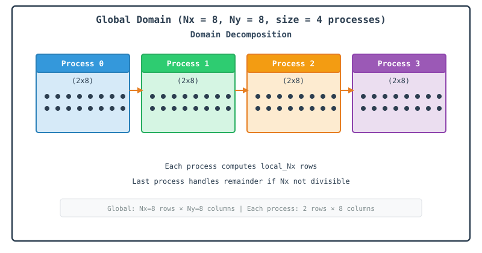
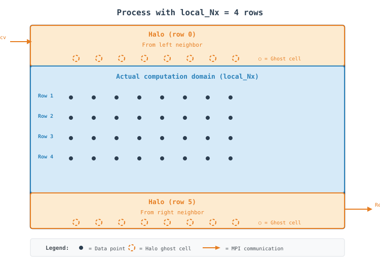
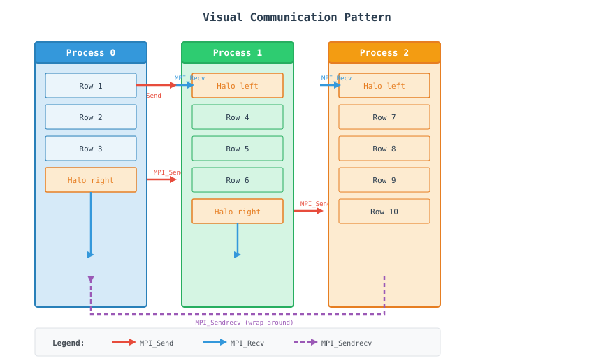
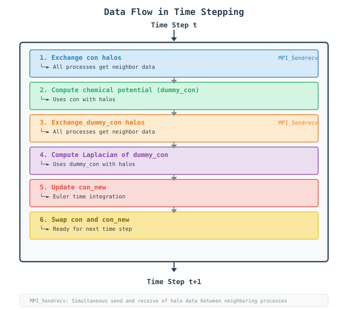
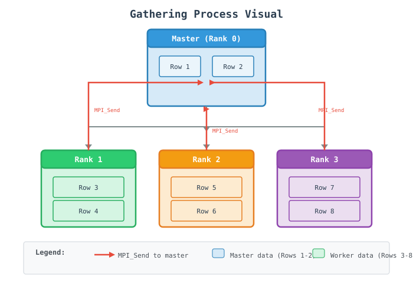
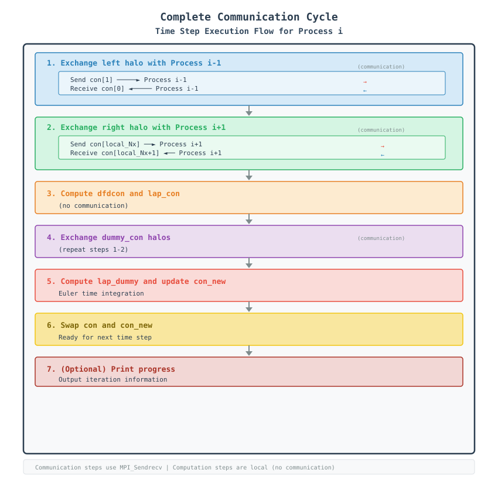
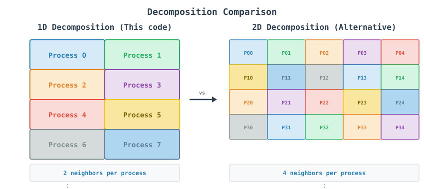
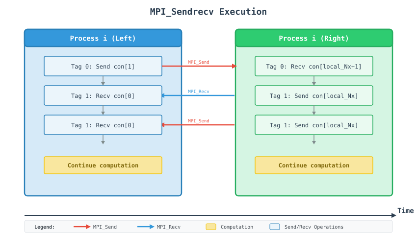

# MPI Finite Difference Phase Field Code - A Tutorial Guide

## Table of Contents
1. [Introduction](#introduction)
2. [Understanding the Physics](#understanding-the-physics)
3. [MPI Concepts for Beginners](#mpi-concepts-for-beginners)
4. [Step-by-Step Code Walkthrough](#step-by-step-code-walkthrough)
5. [Visualization of Domain Decomposition](#visualization-of-domain-decomposition)
6. [Communication Patterns Explained](#communication-patterns-explained)
7. [Running the Code](#running-the-code)
8. [Common Pitfalls and Solutions](#common-pitfalls-and-solutions)
9. [Advanced Topics](#advanced-topics)
10. [Appendix: Quick Reference](#appendix-quick-reference)

---

## Introduction
This document provides a comprehensive tutorial on parallel computing using MPI (Message Passing Interface) through a finite difference code that solves the Cahn-Hilliard equation—a fundamental model for phase separation in materials science. The code uses `Eigen::Array` for vectorized row access, `float` precision, and a load-balanced domain decomposition so the work divides evenly even when the grid size isn't a multiple of the number of processes.

### What You Will Learn
* How to initialize and manage MPI processes
* Load-balanced domain decomposition strategies for scientific computing
* Communication patterns for finite difference stencils using Eigen row buffers
* Data management with halo/ghost cells on `Eigen::Array` matrices
* Performance optimization techniques (precomputed neighbor indices, `-O3 -march=native`, `float` precision)

---

## Understanding the Physics
The Cahn-Hilliard equation describes phase separation in binary alloys:

$$\frac{\partial c}{\partial t} = \nabla \cdot \left[M \nabla \left(\frac{\delta F}{\delta c}\right)\right]$$

where:
* **$c$**: Concentration field
* **$M$**: Mobility
* **$F$**: Free energy functional

The code uses a 5-point finite difference stencil to discretize this equation spatially:

$$\nabla^2 c = \frac{c[i+1,j] + c[i-1,j] + c[i,j+1] + c[i,j-1] - 4c[i,j]}{\Delta x \cdot \Delta y}$$

### Why Parallelize?
The 2D domain is $5000 \times 5000$ grid points — 25 million points evolved for 1000 time steps.
* **Serial:** 25 million points $\times$ 1000 time steps = **too slow** on a single core.
* **Parallel:** Domain divided among processors along the x-direction, each handling $\sim 1/N$ of the rows, with remainder rows spread across the first few ranks so no process is left idle while others do extra work.

---

## MPI Concepts for Beginners
### What is MPI?
MPI is a standardized message-passing library designed for parallel computing. Think of it as a way for different computers (or processors) to talk to each other.

### Key Concepts

| Concept | Analogy | In Our Code |
| :--- | :--- | :--- |
| **Rank** | Worker ID number | Process identifier (0 to `size - 1`) |
| **Communicator** | Group of workers | `MPI_COMM_WORLD` (all processes) |
| **Send/Recv** | Passing notes | Exchanging boundary rows via `exchange_x_halos` |
| **`MPI_PROC_NULL`** | An empty mailbox | Used for the first/last rank's missing neighbor, so no `if` branch is needed around the send/recv calls |

### Process Communication Model

<!-- In HTML -->


## Step-by-Step Code Walkthrough

### Step 1: MPI Initialization

```cpp
MPI_Init(&argc, &argv);

int rank, size;
MPI_Comm_rank(MPI_COMM_WORLD, &rank);
MPI_Comm_size(MPI_COMM_WORLD, &size);

if (rank == 0) {
    std::cout << "Total processors running: " << size << std::endl;
    std::cout << "Grid size: " << Nx << " x " << Ny << std::endl;
    std::cout << "Using float precision" << std::endl;
}
```

#### What happens here?
*   `MPI_Init`: Starts the MPI environment, sets up communication channels.
*   `MPI_Comm_rank`: Each process gets a unique ID (0 to `size - 1`).
*   `MPI_Comm_size`: Total number of processes running.
*   Only rank 0 prints the run configuration, so you don't get the same three lines repeated once per process.

#### Visual Timeline:



### Step 2: Load-Balanced Domain Decomposition

```cpp
int base_Nx = Nx / size;
int remainder = Nx % size;

int local_Nx = base_Nx + (rank < remainder ? 1 : 0);
int start_x = rank * base_Nx + std::min(rank, remainder);
int end_x = start_x + local_Nx;

int local_Nx_halo = local_Nx + 2;
```

#### What happens here?
*   `base_Nx`: the guaranteed minimum number of rows every rank owns.
*   `remainder`: how many ranks need one extra row to cover the full domain.
*   `local_Nx`: ranks `0` through `remainder - 1` get one extra row so the domain divides evenly overall.
*   `start_x`: computed with `std::min(rank, remainder)` so ranks after the first `remainder` ones are offset correctly once the extra rows run out.
*   `local_Nx_halo = local_Nx + 2`: two extra rows reserved for halo cells.

#### Visual Representation:

<!-- In HTML -->


### Step 3: Eigen-Based Halo Allocation

```cpp
using EigenMatrix = Eigen::Array<float, Eigen::Dynamic, Eigen::Dynamic, Eigen::RowMajor>;

EigenMatrix con = EigenMatrix::Zero(local_Nx_halo, Ny);
EigenMatrix dfdcon = EigenMatrix::Zero(local_Nx_halo, Ny);
EigenMatrix lap_con = EigenMatrix::Zero(local_Nx_halo, Ny);
EigenMatrix dummy_con = EigenMatrix::Zero(local_Nx_halo, Ny);
EigenMatrix con_new = EigenMatrix::Zero(local_Nx_halo, Ny);
```

#### What happens here?
*   `Eigen::Array<float, Dynamic, Dynamic, RowMajor>` stores each row contiguously in memory, so a whole row can be sent with a single pointer and length in `MPI_Sendrecv` instead of looping element by element.
*   `RowMajor` is explicit here: Eigen defaults to column-major, which would make `field.row(i).data()` **not** point at contiguous memory.
*   `EigenMatrix::Zero(...)` allocates and zero-initializes in one call.
*   `float` precision keeps each array's memory footprint and the bytes sent per halo exchange smaller — at $5000 \times 5000$, each array is 100 MB.

#### Halo Cells Visual:

<!-- In HTML -->


#### Why are halos needed?
*   To compute derivatives at domain boundaries, we need values from adjacent rows.
*   Rank 1 needs a boundary row from rank 0 (left) and rank 2 (right).
*   Halos act as buffers that temporarily store these "ghost" values after communication.

### Step 4: Data Initialization

```cpp
std::mt19937 rng(rank + 12345);
std::uniform_real_distribution<float> dist(0.0f, 1.0f);

for (int i = 1; i <= local_Nx; ++i) {
    for (int j = 0; j < Ny; ++j) {
        con(i, j) = con_0 + noise * (0.5f - dist(rng));
    }
}

apply_periodic_y(con, local_Nx);
```

#### Important Points:
*   Each process initializes its own unique memory slice, using `(row, col)` Eigen accessors.
*   `rank + 12345` ensures a unique random seed per process, preventing duplicate noise generation.
*   `apply_periodic_y` refreshes the y-boundary ghost columns right after initialization, since Eigen arrays have no built-in wraparound indexing.

### Step 5: Communication - Halo Exchange as a Reusable Function

```cpp
inline void exchange_x_halos(EigenMatrix& field, int local_Nx, int left, int right, 
                             MPI_Comm comm, MPI_Status& status) {
    // Send row 1 to left neighbor, receive into row local_Nx + 1 from right
    MPI_Sendrecv(field.row(1).data(), Ny, MPI_FLOAT, left, 0,
                 field.row(local_Nx + 1).data(), Ny, MPI_FLOAT, right, 0,
                 comm, &status);

    // Send row local_Nx to right neighbor, receive into row 0 from left
    MPI_Sendrecv(field.row(local_Nx).data(), Ny, MPI_FLOAT, right, 1,
                 field.row(0).data(), Ny, MPI_FLOAT, left, 1,
                 comm, &status);
}
```

#### What happens here?
*   `field.row(1).data()`: Eigen exposes a raw pointer into the row's contiguous memory, so `MPI_Sendrecv` can be called exactly as it would be on a plain C array.
*   `MPI_FLOAT` matches the `float` precision of `EigenMatrix`.
*   `left`/`right` use `MPI_PROC_NULL` for the domain's outer edges, so this function needs no special-casing for rank 0 or the last rank.
*   This function is reused for both `con` and `dummy_con`, since the stencil computation is split into two passes with a halo exchange between them.

#### Visual Communication Pattern:

<!-- In HTML -->


### Step 6: Computation - Two Passes

**Pass 1 — chemical potential:**
```cpp
inline void compute_laplacian_and_chemical_potential(
    const EigenMatrix& con, EigenMatrix& dfdcon, EigenMatrix& lap_con,
    EigenMatrix& dummy_con, int local_Nx,
    float dx, float dy, float A, float grad_coef)
{
    const float inv_dxdy = 1.0f / (dx * dy);

    static std::vector<int> jp(Ny), jm(Ny);
    static bool initialized = false;
    if (!initialized) {
        for (int j = 0; j < Ny; ++j) {
            jp[j] = (j + 1) % Ny;
            jm[j] = (j - 1 + Ny) % Ny;
        }
        initialized = true;
    }

    for (int i = 1; i <= local_Nx; ++i) {
        const auto& con_i = con.row(i);
        const auto& con_ip1 = con.row(i + 1);
        const auto& con_im1 = con.row(i - 1);
        auto dfdcon_i = dfdcon.row(i);
        auto lap_con_i = lap_con.row(i);
        auto dummy_con_i = dummy_con.row(i);

        for (int j = 0; j < Ny; ++j) {
            const float c = con_i(j);
            dfdcon_i(j) = A * (2.0f * c * (1.0f - c) * (1.0f - 2.0f * c));
            lap_con_i(j) = (con_ip1(j) + con_im1(j) +
                           con_i(jp[j]) + con_i(jm[j]) -
                           4.0f * c) * inv_dxdy;
            dummy_con_i(j) = dfdcon_i(j) - grad_coef * lap_con_i(j);
        }
    }
}
```

**Pass 2 — second Laplacian and time integration:**
```cpp
inline void update_field(
    const EigenMatrix& con, const EigenMatrix& dummy_con, EigenMatrix& con_new,
    int local_Nx, float dt, float mobility, float inv_dxdy)
{
    static std::vector<int> jp(Ny), jm(Ny);
    // ... same precomputed neighbor tables ...

    const float factor = dt * mobility * inv_dxdy;

    for (int i = 1; i <= local_Nx; ++i) {
        const auto& con_i = con.row(i);
        const auto& dummy_i = dummy_con.row(i);
        const auto& dummy_ip1 = dummy_con.row(i + 1);
        const auto& dummy_im1 = dummy_con.row(i - 1);
        auto con_new_i = con_new.row(i);

        for (int j = 0; j < Ny; ++j) {
            const float lap_dummy = (dummy_ip1(j) + dummy_im1(j) +
                                    dummy_i(jp[j]) + dummy_i(jm[j]) -
                                    4.0f * dummy_i(j));
            float c_new = con_i(j) + factor * lap_dummy;
            con_new_i(j) = std::max(CLAMP_LOW, std::min(c_new, CLAMP_HIGH));
        }
    }
}
```

#### What happens here?
*   `jp[j]` / `jm[j]`: precomputed once via a function-local `static` array instead of recomputed with `%` on every inner-loop iteration.
*   `con.row(i)`, `con.row(i+1)`, etc. return Eigen expressions bound to `const auto&`, avoiding row copies while keeping the inner loop readable.
*   Pass 1 computes `dfdcon`, `lap_con`, and the chemical potential `dummy_con`.
*   Pass 2 computes `lap_dummy` from `dummy_con`'s neighbors and advances the concentration field with a clamped forward-Euler step: `std::max(CLAMP_LOW, std::min(c_new, CLAMP_HIGH))`.
*   `dummy_con` needs its own halo exchange (Step 7) before Pass 2 can read its neighboring rows correctly.

### Step 7: The Evolution Loop

```cpp
int left  = (rank == 0) ? MPI_PROC_NULL : rank - 1;
int right = (rank == size - 1) ? MPI_PROC_NULL : rank + 1;

for (int tsteps = 1; tsteps <= nsteps; ++tsteps) {
    exchange_x_halos(con, local_Nx, left, right, MPI_COMM_WORLD, status);

    compute_laplacian_and_chemical_potential(
        con, dfdcon, lap_con, dummy_con, local_Nx, dx, dy, A, grad_coef);

    exchange_x_halos(dummy_con, local_Nx, left, right, MPI_COMM_WORLD, status);

    update_field(con, dummy_con, con_new, local_Nx, dt, mobility, inv_dxdy);

    std::swap(con, con_new);
    apply_periodic_y(con, local_Nx);

    if (tsteps % nprint == 0 && rank == 0) {
        std::cout << "Done steps = " << tsteps << std::endl;
    }
}
```

#### What happens here?
*   `MPI_PROC_NULL` makes `MPI_Sendrecv` treat the missing side as a no-op automatically, so `exchange_x_halos` needs no `if (rank != 0)` guard.
*   Each time step performs two halo exchanges: one for `con` before Pass 1, and one for `dummy_con` before Pass 2.
*   `std::swap(con, con_new)` is an O(1) pointer/metadata swap, no data copy.
*   `apply_periodic_y(con, local_Nx)` refreshes the ghost columns at `j = 0` and `j = Ny - 1` every step, right after the swap.

#### Data Flow in Time Stepping:

<!-- In HTML -->


### Step 8: Final Output

```cpp
if (rank == 0) {
    std::cout << "  Total Run Time = " << (mpi_end_time - mpi_start_time) << " seconds." << std::endl;

    int rows_to_print = std::min(5, local_Nx);
    for (int i = 1; i <= rows_to_print; ++i) {
        for (int j = 0; j < 5; ++j) {
            std::cout << std::setw(10) << con(i, j) << " ";
        }
        std::cout << "\n";
    }

    int output_size = std::min(100, local_Nx);
    std::ofstream outfile("ch_small.dat");
    for (int i = 1; i <= output_size; ++i) {
        for (int j = 0; j < std::min(100, Ny); ++j) {
            outfile << con(i, j) << (j < 99 ? " " : "");
        }
        outfile << "\n";
    }
}
```

#### What happens here?
*   Only rank 0 prints and writes output — no gather step, so no communication happens in this stage.
*   `rows_to_print`: at most 5 rows, printed to the console for a quick sanity check.
*   `output_size`: up to a `100 x 100` corner of rank 0's local `con` array, written to `ch_small.dat`.
*   All of the values printed and written here come from rank 0's own local slice of the domain.

#### Gathering Process Visual:

<!-- In HTML -->


### Step 9: Timing and Performance Measurement

```cpp
float mpi_start_time = MPI_Wtime();
// ... computation ...
float mpi_end_time = MPI_Wtime();

std::cout << "  Total Run Time = " << (mpi_end_time - mpi_start_time) << " seconds." << std::endl;
```

#### Wall-clock vs MPI Time:

```
Wall-clock time: Overall execution time including MPI overhead
MPI time:        Time spent in MPI operations (communication overhead)

Total Time = Computation Time + Communication Time + Idle Time
```

#### Visualization of Complete Communication Cycle

<!-- In HTML -->


#### Why 1D Decomposition?

#### Advantages
*   Simple to implement with clear top/bottom boundary targets.
*   Only two active neighbors to manage (left and right).
*   Low code complexity for structured meshing.
*   Load-balanced across ranks (Step 2).

#### Disadvantages
*   Poor scalability ceiling if using thousands of ranks.
*   Network layout bottlenecks when partitioning data along only one direction.

<!-- In HTML -->


## Communication Patterns Explained

### MPI_Sendrecv: The Superhero of MPI

### Why use MPI_Sendrecv instead of separate Send and Recv?

### Problem with separate Send/Recv:

```cpp
// DANGER: Potential Deadlock!
MPI_Send(field.row(1).data(), Ny, MPI_FLOAT, left, 0, MPI_COMM_WORLD);
MPI_Recv(field.row(local_Nx+1).data(), Ny, MPI_FLOAT, right, 0, MPI_COMM_WORLD, &status);
```

If both processes send first, both will wait forever (deadlock).

### Solution with MPI_Sendrecv:

```cpp
// SAFE: Combined send and receive handled safely by runtime engine
MPI_Sendrecv(field.row(1).data(), Ny, MPI_FLOAT, left, 0,
             field.row(local_Nx+1).data(), Ny, MPI_FLOAT, right, 0,
             MPI_COMM_WORLD, &status);
```
MPI handles the synchronization internally, preventing deadlocks. `MPI_PROC_NULL` means neither `left` nor `right` ever need to be checked before the call, since MPI silently skips the send or receive side when the partner is `MPI_PROC_NULL`.

## Communication Timeline

### MPI_Sendrecv Execution:



## Blocking vs Non-blocking Communication

| Aspect | Blocking (This code) | Non-blocking (Alternative) |
| :--- | :--- | :--- |
| **Function** | `MPI_Sendrecv` (via `exchange_x_halos`) | `MPI_Isend` / `MPI_Irecv` |
| **Behavior** | Waits for completion | Returns immediately |
| **Overlap** | No computation during communication | Can compute while communicating |
| **Complexity** | Simple | Requires `MPI_Wait` / `MPI_Test` |
| **Performance** | Lower for large messages | Higher potential performance |

### Non-blocking would look like:

```cpp
MPI_Request req[4];
MPI_Isend(field.row(1).data(), Ny, MPI_FLOAT, left, 0, MPI_COMM_WORLD, &req[0]);
MPI_Irecv(field.row(local_Nx + 1).data(), Ny, MPI_FLOAT, right, 0, MPI_COMM_WORLD, &req[1]);
// Compute here while communication happens!
MPI_Waitall(2, req, MPI_STATUSES_IGNORE);
```

### Running the Code

#### Compilation

**Linux (GCC/OpenMPI, with Eigen headers on the include path):**
```bash
mpic++ main.cpp -O3 -march=native -std=c++20 -I /usr/include/eigen3/ -o main
```

**Windows (Intel MPI):**
```bash
mpiicpx -I"C:\libs\eigen-5.0.0" main.cpp
```

Eigen is a header-only library, so `-I` points at the headers and nothing needs to be linked. `-march=native` lets the compiler auto-vectorize the `float` stencil loops for the specific CPU it's built on.

#### Running

**Basic Run (4 processes):**
```bash
mpirun -np 4 ./main
```
Scale `-np` based on available cores and memory — each rank needs `local_Nx_halo x Ny x 4 bytes x 5 arrays` of memory.

---

## Common Pitfalls and Solutions

### 1. Column-Major Eigen Arrays

**Problem:**
```cpp
// Wrong: default Eigen storage order is ColMajor
using EigenMatrix = Eigen::Array<float, Eigen::Dynamic, Eigen::Dynamic>;
// field.row(i).data() no longer points at contiguous row memory!
```

**Solution:**
```cpp
// Correct: explicit RowMajor storage
using EigenMatrix = Eigen::Array<float, Eigen::Dynamic, Eigen::Dynamic, Eigen::RowMajor>;
```
`field.row(i).data()` must point to `Ny` contiguous floats for `MPI_Sendrecv` to work correctly.

### 2. Forgetting the Second Halo Exchange

**Problem:**
```cpp
exchange_x_halos(con, local_Nx, left, right, MPI_COMM_WORLD, status);
compute_laplacian_and_chemical_potential(con, dfdcon, lap_con, dummy_con, ...);
// Missing: exchange_x_halos(dummy_con, ...)
update_field(con, dummy_con, con_new, ...);  // reads stale dummy_con halos!
```

**Solution:** Exchange `dummy_con`'s halos between the two computation passes, as shown in Step 7.

### 3. Forgetting `apply_periodic_y` After the Swap

**Problem:**
```cpp
std::swap(con, con_new);
// Missing: apply_periodic_y(con, local_Nx);
// Next iteration's stencil reads stale y-boundary values from before the swap
```

**Solution:** Call `apply_periodic_y(con, local_Nx)` immediately after every swap, as shown in Step 7.

### 4. Mismatched MPI Datatype

**Problem:**
```cpp
MPI_Sendrecv(field.row(1).data(), Ny, MPI_DOUBLE, left, 0, ...);  // Wrong! Array is float
```

**Solution:**
```cpp
MPI_Sendrecv(field.row(1).data(), Ny, MPI_FLOAT, left, 0, ...);  // Matches EigenMatrix's float
```

### 5. Assuming Rank 0's Output Is the Full Domain

**Problem:** Treating `ch_small.dat` as a full-field snapshot, when it only contains rank 0's local corner.

**Solution:** Add a gather step (see [Advanced Topics](#advanced-topics)) if the complete `5000 x 5000` field is needed.

---

## Advanced Topics

### Full-Domain Gather

To collect the complete field on rank 0 (e.g. for plotting):

```cpp
if (rank == 0) {
    EigenMatrix full_con = EigenMatrix::Zero(Nx, Ny);
    full_con.block(start_x, 0, local_Nx, Ny) = con.block(1, 0, local_Nx, Ny);

    for (int p = 1; p < size; ++p) {
        int p_local_Nx = base_Nx + (p < remainder ? 1 : 0);
        int p_start_x  = p * base_Nx + std::min(p, remainder);

        std::vector<float> recv_buf(p_local_Nx * Ny);
        MPI_Recv(recv_buf.data(), p_local_Nx * Ny, MPI_FLOAT, p, 0,
                 MPI_COMM_WORLD, MPI_STATUS_IGNORE);
        // Copy recv_buf into full_con.block(p_start_x, 0, p_local_Nx, Ny)
    }
} else {
    MPI_Send(con.data() + Ny, local_Nx * Ny, MPI_FLOAT, 0, 0, MPI_COMM_WORLD);
}
```

Each rank's row count and starting offset are recomputed with `base_Nx` / `remainder`, since the decomposition is load-balanced rather than uniform.

### Non-blocking Halo Exchange

Convert `exchange_x_halos` to `MPI_Isend`/`MPI_Irecv` so the CPU can start `compute_laplacian_and_chemical_potential` on interior rows while boundary rows are still in flight.

### MPI + OpenMP Hybrid

Combine with OpenMP to parallelize the inner `j` loops of `compute_laplacian_and_chemical_potential` and `update_field` within each rank:

```cpp
#pragma omp parallel for
for (int i = 1; i <= local_Nx; ++i) {
    // existing row-wise computation
}
```

### Precision Trade-offs

`float` halves memory and communication volume relative to `double`, at the cost of reduced precision — worth profiling both for simulations sensitive to numerical drift over long runs.

---

## Appendix: Quick Reference

### Key Constants

| Constant | Value |
| :--- | :--- |
| `Nx`, `Ny` | 5000, 5000 |
| `nsteps` | 1000 |
| `dt` | 0.01f |
| Precision | `float` |
| `CLAMP_LOW` / `CLAMP_HIGH` | `1e-5f` / `0.99999f` |

### MPI Functions Used

| Function | Purpose |
| :--- | :--- |
| `MPI_Init` / `MPI_Finalize` | Start/stop the MPI environment |
| `MPI_Comm_rank` / `MPI_Comm_size` | Identify this process / count all processes |
| `MPI_Sendrecv` | Combined, deadlock-safe send + receive |
| `MPI_PROC_NULL` | "No-op" neighbor for domain edges |
| `MPI_Wtime` | High-resolution wall-clock timer |

### Eigen Types Used

| Type | Purpose |
| :--- | :--- |
| `Eigen::Array<float, Dynamic, Dynamic, RowMajor>` | The `EigenMatrix` alias — contiguous rows for MPI |
| `EigenMatrix::Zero(rows, cols)` | Allocate + zero-initialize |
| `field.row(i)` | Row accessor, `.data()` gives a raw contiguous pointer |
| `field.block(row, col, rows, cols)` | Sub-block view/assignment, useful for gather-style code |

---

```{toctree}
:maxdepth: 1
:caption: MPI Topics
