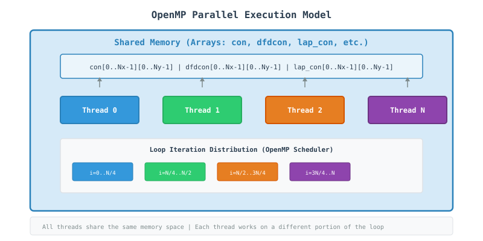
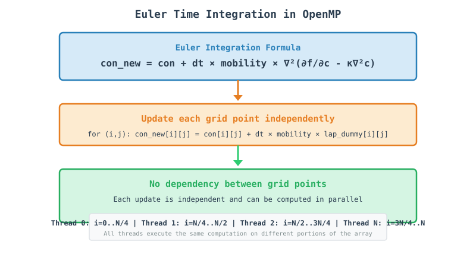
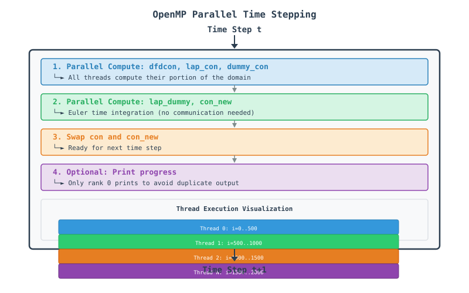

# OpenMP Finite Difference Phase Field Code - A Tutorial Guide

## Table of Contents
1. [Introduction](#introduction)
2. [Understanding the Physics](#understanding-the-physics)
3. [OpenMP Concepts for Beginners](#openmp-concepts-for-beginners)
4. [Step-by-Step Code Walkthrough](#step-by-step-code-walkthrough)
5. [Visualization of Parallel Execution](#visualization-of-parallel-execution)
6. [Performance Optimization](#performance-optimization)
7. [Running the Code](#running-the-code)
8. [Common Pitfalls and Solutions](#common-pitfalls-and-solutions)
9. [Advanced Topics](#advanced-topics)
10. [Appendix: Quick Reference](#appendix-quick-reference)

---

## Introduction
This document provides a comprehensive tutorial on parallel computing using OpenMP (Open Multi-Processing) through a finite difference code that solves the Cahn-Hilliard equation—a fundamental model for phase separation in materials science. The code demonstrates how to take a serial computational problem and parallelize it across multiple CPU cores within a single compute node.

### What You Will Learn
* How to use OpenMP directives for parallel programming
* Shared memory programming concepts
* Loop parallelization strategies
* Data management with shared arrays
* Performance optimization techniques for multi-core systems

---

## Understanding the Physics
The Cahn-Hilliard equation describes phase separation in binary alloys:

$$\frac{\partial c}{\partial t} = \nabla \cdot \left[M \nabla \left(\frac{\delta F}{\delta c}\right)\right]$$

where:
* **$c$**: Concentration field
* **$M$**: Mobility
* **$F$**: Free energy functional

The code uses a 5-point finite difference stencil to discretize this equation spatially:

$$\nabla^2 c = \frac{c[i+1,j] + c[i-1,j] + c[i,j+1] + c[i,j-1] - 4c[i,j]}{\Delta x \cdot \Delta y}$$

### Why Parallelize with OpenMP?
The 2D domain is $2000 \times 2000$ grid points. For realistic simulations:
* **Serial:** 4 million points $\times$ 1000 time steps = **too slow** for real-time exploration
* **OpenMP Parallel:** Domain divided among threads, each handling $\sim 1/N$ of the work using shared memory

---

## OpenMP Concepts for Beginners
### What is OpenMP?
OpenMP is a shared-memory parallel programming API that allows developers to write multi-threaded applications using simple compiler directives. Think of it as a way for multiple CPU cores within a single computer to work together on the same problem.

### Key Concepts

| Concept | Analogy | In Our Code |
| :--- | :--- | :--- |
| **Thread** | Individual worker | CPU core executing a portion of the loop |
| **Parallel Region** | Team of workers | Code block executed by multiple threads |
| **Worksharing** | Dividing tasks | `#pragma omp parallel for` distributes loop iterations |
| **Shared Memory** | Common workspace | All threads access the same arrays (`con`, `dfdcon`, etc.) |
| **Private Variable** | Personal notebook | Variables like `ip`, `im`, `jp`, `jm` are thread-private |

### Thread Execution Model

<!-- In HTML -->


## Step-by-Step Code Walkthrough

### Step 1: Include OpenMP Headers

```cpp
#include <omp.h>
```

#### What happens here?
*   OpenMP provides compiler directives and runtime functions.
*   The `omp.h` header declares the OpenMP API functions.
*   Without this header, `#pragma omp` directives still work, but runtime functions won't.

### Step 2: Set Domain Parameters

```cpp
constexpr int Nx = 2000;
constexpr int Ny = 2000;
constexpr int nsteps = 1000;
```

#### Why these sizes?
*   **2000×2000** = 4 million grid points.
*   Each thread works on a portion of this domain.
*   With 8 threads, each handles ~500×2000 = 1 million points.

### Step 3: Allocate Arrays

```cpp
Matrix con(Nx, std::vector<double>(Ny, 0.0));
Matrix con_new(Nx, std::vector<double>(Ny, 0.0));
Matrix dfdcon(Nx, std::vector<double>(Ny, 0.0));
Matrix lap_con(Nx, std::vector<double>(Ny, 0.0));
Matrix dummy_con(Nx, std::vector<double>(Ny, 0.0));
Matrix lap_dummy(Nx, std::vector<double>(Ny, 0.0));
```

#### Memory Layout:

<!-- In HTML -->


### Step 4: Initialize Microstructure

```cpp
std::mt19937 rng(std::random_device{}());
std::uniform_real_distribution<double> dist(0.0, 1.0);

for (int i = 0; i < Nx; ++i) {
    for (int j = 0; j < Ny; ++j) {
        double r = dist(rng);
        con[i][j] = con_0 + noise * (0.5 - r);
    }
}
```

#### Important Points:
*   No parallelization needed here (small overhead).
*   All threads share the same `con` array.
*   Initialization is done serially for simplicity.

### Step 5: Parallel Computation Loop

```cpp
#pragma omp parallel for collapse(2) \
shared(con, dfdcon, lap_con, dummy_con) \
private(ip, im, jp, jm)
for (int i = 0; i < Nx; i++) {
    for (int j = 0; j < Ny; j++) {
        // Compute dfdcon, lap_con, dummy_con
    }
}
```

#### Key Directives Explained:

| Directive | Purpose |
| :--- | :--- |
| `#pragma omp parallel for` | Parallelize the following loop |
| `collapse(2)` | Collapse nested loops into a single parallel loop |
| `shared(...)` | Variables accessible by all threads |
| `private(...)` | Each thread gets its own copy |

### Step 6: Compute Free Energy Derivative

```cpp
dfdcon[i][j] = A * (2.0 * con[i][j] * (1.0 - con[i][j]) * (1.0 - con[i][j]) - 
             2.0 * con[i][j] * con[i][j] * (1.0 - con[i][j]));
```

#### Why no communication needed?
*   All data is in shared memory.
*   No halo cells required.
*   Threads work independently on different parts of the array.

### Step 7: Compute Laplacian

```cpp
int jp = j + 1;
int jm = j - 1;
int ip = i + 1;
int im = i - 1;

if (im == -1) im = Nx - 1;
if (ip == Nx) ip = 0;
if (jm == -1) jm = Ny - 1;
if (jp == Ny) jp = 0;

lap_con[i][j] = (con[ip][j] + con[im][j] + con[i][jm] +
                 con[i][jp] - 4.0 * con[i][j]) / (dx * dx);
```

#### Why periodic boundaries work:
*   `im` and `ip` wrap around using modulo logic.
*   No communication overhead for boundary conditions.
*   Simple indexing with if statements.

### Step 8: Time Integration

```cpp
con_new[i][j] = con[i][j] + dt * mobility * lap_dummy[i][j];
con_new[i][j] = std::clamp(con_new[i][j], 0.00001, 0.99999);
```

#### Euler Integration:


<!-- In HTML -->


### Step 9: Data Swap

```cpp
std::swap(con, con_new);
```

#### Why this works:
*   `con` becomes the new state.
*   `con_new` holds the old state (to be overwritten next iteration).
*   No copying overhead - just pointer swap.

---

## Visualization of Parallel Execution

### Time Stepping Flow:

<!-- In HTML -->


---

## Performance Optimization

### Loop Collapse

#### Without `collapse(2)`:

```cpp
#pragma omp parallel for
for (int i = 0; i < Nx; i++) {
    for (int j = 0; j < Ny; j++) {
        // Only outer loop is parallelized
        // Each thread gets a range of i values
    }
}
```

#### With `collapse(2)`:

```cpp
#pragma omp parallel for collapse(2)
for (int i = 0; i < Nx; i++) {
    for (int j = 0; j < Ny; j++) {
        // Both loops are collapsed into one
        // Better load balancing for small Nx
    }
}
```

#### When to use `collapse`:
*   **Use it when**: Nx is small or uneven.
*   **Avoid it when**: Nx is large and Ny is small (overhead).
*   **Rule of thumb**: Use for 2D/3D stencils with balanced dimensions.

### Scheduling Strategies

| Schedule | Behavior | Best For |
| :--- | :--- | :--- |
| **`static`** | Fixed chunk sizes | Regular workloads |
| **`dynamic`** | Runtime assignment | Irregular workloads |
| **`guided`** | Decreasing chunk sizes | Balanced workload |
| **`auto`** | Compiler decides | General use |

#### Example:

```cpp
#pragma omp parallel for schedule(dynamic, 32)
for (int i = 0; i < Nx; i++) {
    // Dynamic scheduling with chunk size 32
    // Threads grab chunks of 32 iterations
}
```

### Cache Optimization

#### Memory Access Patterns:

**Good (Column-major):**
```cpp
for (int j = 0; j < Ny; j++) {
    for (int i = 0; i < Nx; i++) {
        // Access con[i][j]
        // Better cache locality
    }
}
```

**Bad (Row-major - Our Code):**
```cpp
for (int i = 0; i < Nx; i++) {
    for (int j = 0; j < Ny; j++) {
        // Access con[i][j]
        // Strided access pattern
    }
}
```

#### Why our code works:
*   C++ uses row-major layout by default.
*   The `vector<vector<double>>` approach stores rows contiguously.
*   Each thread works on a contiguous block of rows.

---

## Running the Code

### Compilation

Using GCC with OpenMP support:

```bash
g++ -std=c++17 -O3 -fopenmp -o cahn_hilliard main.cpp
```

### Running

**Basic Run (8 threads):**
```bash
export OMP_NUM_THREADS=8
./cahn_hilliard
```

### Performance Monitoring

#### Using Linux tools:
```bash
# Monitor CPU usage
htop

# Monitor thread activity
perf stat ./cahn_hilliard

# Monitor cache misses
perf stat -e cache-misses,cache-references ./cahn_hilliard
```
---

## Common Pitfalls and Solutions


### 1. Insufficient Parallelism

**Problem:** Loop has too few iterations for many threads.

**Solution:** Use `collapse` or adjust chunk size:
```cpp
#pragma omp parallel for collapse(2) schedule(dynamic)
for (int i = 0; i < Nx; i++) {
    for (int j = 0; j < Ny; j++) {
        // More iterations = better parallelization
    }
}
```

### 2. Memory Bottlenecks

**Problem:** All threads accessing the same memory at the same time.

**Solution:** Use thread-local variables:
```cpp
#pragma omp parallel for private(local_array)
for (int i = 0; i < Nx; i++) {
    double local_array[100];  // Each thread gets its own copy
    // Compute using local_array
}
```

---

## Advanced Topics

### SIMD Vectorization

OpenMP 4.0+ supports SIMD directives:

```cpp
#pragma omp simd
for (int i = 0; i < Nx; i++) {
    // Compiler will vectorize this loop
    con_new[i] = con[i] + dt * lap_dummy[i];
}
```

### GPU Offloading with OpenMP

OpenMP 4.5+ supports GPU offloading:

```cpp
#pragma omp target teams distribute parallel for
for (int i = 0; i < Nx; i++) {
    // Code runs on GPU
}
```

---

## Appendix: Quick Reference

### OpenMP Directives

| Directive | Purpose |
| :--- | :--- |
| `#pragma omp parallel` | Create parallel region |
| `#pragma omp for` | Distribute loop iterations |
| `#pragma omp parallel for` | Combined parallel + for |
| `#pragma omp sections` | Distribute independent tasks |
| `#pragma omp single` | Execute code by one thread |
| `#pragma omp master` | Execute code by master thread |
| `#pragma omp critical` | Ensure exclusive access |
| `#pragma omp barrier` | Synchronize all threads |
| `#pragma omp task` | Create a task |

### OpenMP Clauses

| Clause | Purpose |
| :--- | :--- |
| `private(list)` | Thread-private variables |
| `shared(list)` | Shared variables |
| `firstprivate(list)` | Private with initial value |
| `lastprivate(list)` | Private with final value |
| `reduction(op:list)` | Reduction operation |
| `schedule(type,chunk)` | Scheduling policy |
| `collapse(n)` | Collapse nested loops |
| `nowait` | Don't wait for other threads |
| `if(condition)` | Conditional parallelization |

### Environment Variables

| Variable | Purpose |
| :--- | :--- |
| `OMP_NUM_THREADS` | Number of threads |
| `OMP_STACKSIZE` | Thread stack size |

```{toctree}
:maxdepth: 1
:caption: OpenMP Topics