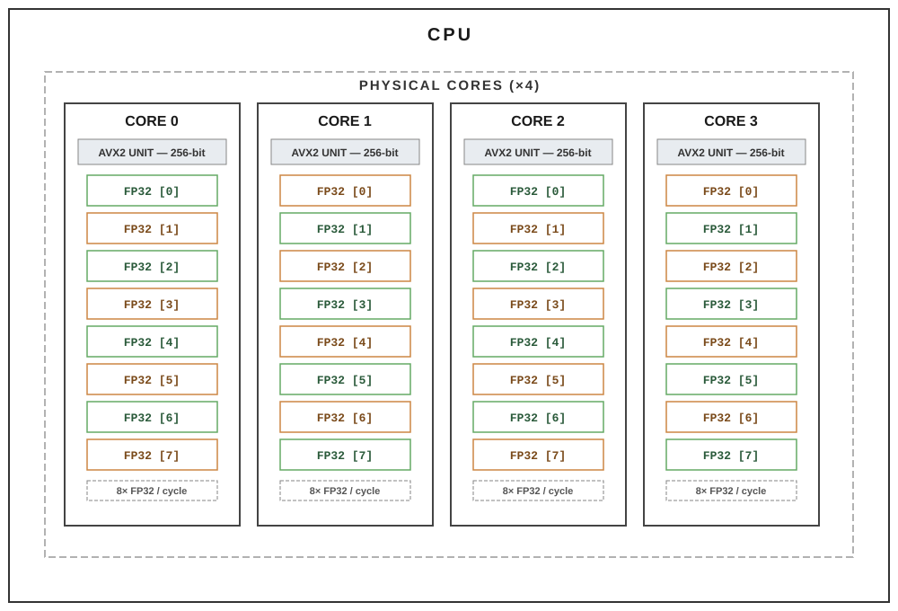
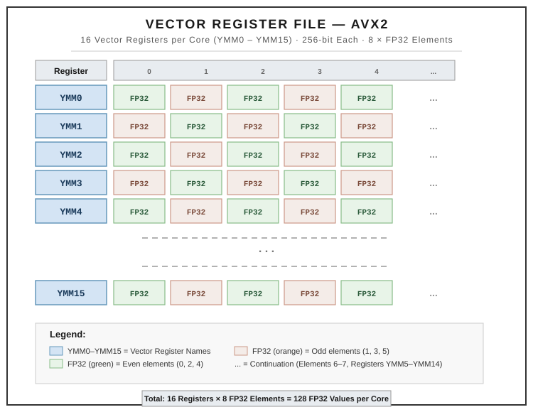
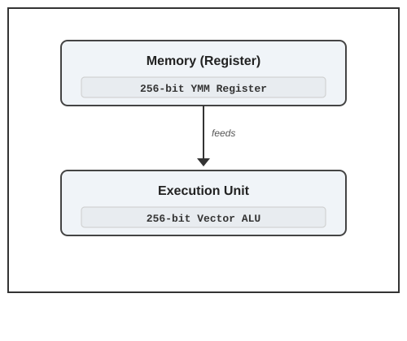

# Understanding AVX2 Vector Processors and Register Files: A Practical Guide for HPC Programmers

## Introduction

High-performance computing (HPC) applications spend most of their execution time performing arithmetic operations on large arrays. Whether solving partial differential equations, running finite element simulations, or executing phase-field models, performance ultimately depends on how efficiently the processor can execute vector operations.

Modern CPUs achieve this efficiency through **SIMD (Single Instruction, Multiple Data)** execution, where one instruction performs the same operation on multiple data elements simultaneously.

To optimize scientific codes, it is therefore important to understand three fundamental architectural components:

1. **Vector Processing Units (VPUs)** – the hardware that performs computations.
2. **Vector Register Files** – the high-speed storage that feeds data to the VPUs.
3. **The relationship between vector width, register capacity, and execution throughput.**

This article explains these concepts using the Intel Core i5-8300H processor, which supports the AVX2 instruction set.

---

## 1. Hardware Overview

The processor considered here contains

* **4 physical CPU cores**
* **AVX2 vector instruction set**
* **256-bit vector units**
* **Single-precision (32-bit) floating-point arithmetic**

Each core operates independently and contains its own execution hardware and register file.


<!-- In HTML -->



## 2. Vector Processing Units

A **Vector Processing Unit (VPU)** is the arithmetic engine responsible for performing SIMD computations.

Unlike a traditional scalar processor, which computes one floating-point value at a time, a vector processor computes multiple values simultaneously.

For AVX2,

$$
\text{Vector Width}=256 \space \text{bits}
$$

Since a single-precision floating-point number occupies

$$ 
{32} \space \text{bits}
$$

the number of floating-point values processed simultaneously is

$$
\frac{256}{32}=8
$$

Thus,

> **One AVX2 instruction can process eight single-precision floating-point values in one vector operation.**

This is often referred to as an **8-wide SIMD architecture** shown above in  Figure.

---

### 2.1 A Concrete Example: Vector Addition

Abstract element counts become much clearer with an actual example.

Consider two arrays, each holding exactly 8 single-precision values — the same width as one YMM register:

```
A = [1, 2, 3, 4, 5, 6, 7, 8]
B = [1, 2, 3, 4, 5, 6, 7, 8]
```

The goal is to compute the element-wise sum

$$
C = A + B
$$

**Scalar execution** (without SIMD) would require **8 separate add instructions**, one per element:

```
C[0] = A[0] + B[0]
C[1] = A[1] + B[1]
C[2] = A[2] + B[2]
C[3] = A[3] + B[3]
C[4] = A[4] + B[4]
C[5] = A[5] + B[5]
C[6] = A[6] + B[6]
C[7] = A[7] + B[7]
```

**AVX2 execution** instead loads all 8 elements of `A` into one YMM register, all 8 elements of `B` into another YMM register, and issues a **single vector-add instruction**:

```
YMM0 = [1, 2, 3, 4, 5, 6, 7, 8]     ← A
YMM1 = [1, 2, 3, 4, 5, 6, 7, 8]     ← B

VADDPS YMM2, YMM0, YMM1              ← one instruction, 8 additions
```

The result is produced in a single step:

```
C = YMM2 = [2, 4, 6, 8, 10, 12, 14, 16]
```

This is the practical meaning of "8-wide SIMD" introduced above: one `VADDPS` instruction replaces eight scalar `ADD` instructions, because the 256-bit register holds all eight operand pairs at once and the 256-bit vector ALU adds them in parallel.

This example also sets up a natural follow-up question, addressed in a companion article: addition is a single arithmetic operation, but many HPC kernels (matrix multiplication, convolutions, stencil computations) require a *multiply followed by an add* — `C = A × B + D`. The question of whether that combined operation can also be done in a single vector step, rather than two, is answered by **Fused Multiply-Add (FMA)**, covered next.

---

## 3. Vector Registers

The VPU cannot directly read data from main memory.

Instead, operands are first loaded into **vector registers**, which act as extremely fast local storage located beside the execution units.

For AVX2,

* 16 vector registers per core
* Registers named

```
YMM0
YMM1
...
YMM15
```

Each register stores

* 256 bits
* or
* 8 single-precision floating-point values.

Therefore,

$$
16\times8=128
$$

Each CPU core can store

> **128 single-precision floating-point values inside its vector register file.**

It is important to distinguish between **storage capacity** and **processing capability**.

The register file stores data, while the vector processor performs computations.



---

## 4. Why Register Width Matches Vector Width

One elegant feature of SIMD processor design is that the register width exactly matches the execution width.



This one-to-one relationship provides several advantages:

* no register splitting
* no partial execution
* full utilization of the arithmetic pipelines
* one vector instruction completely fills the execution hardware

Consequently, every AVX2 instruction naturally operates on an entire register.

---

## 5. Scaling to Multiple CPU Cores

Each CPU core possesses its own independent vector hardware.

For a processor with four cores,

### Register Capacity

Each core stores

$$
128\text{ elements}
$$

Therefore,

$$
4\times128=512
$$

The complete processor can collectively hold

> **512 single-precision floating-point values inside its vector registers.**

---

### Processing Throughput

Each core computes

$$
8
$$

floating-point values per vector operation.

Across four cores,

$$
4\times8=32
$$

Therefore,

> **The processor can compute 32 single-precision floating-point values simultaneously when all four cores execute vector instructions in parallel.** 

---

## 6. Example: Processing a 512-Element Array

Suppose a one-dimensional array contains

$$
512
$$

single-precision values.

When parallelized evenly across four cores,

each core receives

$$
\frac{512}{4}=128
$$

elements.

Interestingly,

128 elements exactly matches the storage capacity of each core's vector register file.

Thus,

```
Core 0 → 128 elements
Core 1 → 128 elements
Core 2 → 128 elements
Core 3 → 128 elements
```

Each core processes

8 elements per vector instruction.

Therefore,

$$
\frac{128}{8}=16
$$

vector operations are required per core.

Since all four cores operate simultaneously,

the entire processor executes

$$
32
$$

elements during each vector step.

Hence,

$$
\frac{512}{32}=16
$$

vector-processing steps are required to complete the computation.

This demonstrates that the workload perfectly matches both the available register capacity and the vector execution width of the processor. 

---

## 7. What This Means for HPC Developers

Understanding these architectural limits provides valuable insight into performance optimization.

When writing scientific software, efficient SIMD execution depends on several factors:

* writing vectorizable loops
* minimizing dependencies between iterations
* ensuring data is contiguous in memory
* aligning memory accesses where possible
* exposing enough independent work for all CPU cores

Compilers such as Intel oneAPI, GCC, LLVM, and NVIDIA HPC SDK attempt to generate vector instructions automatically. However, achieving high performance still requires writing code that maps naturally onto the processor's vector architecture.

---

## 8. An Important Clarification

A common misconception is that because the four cores collectively have enough register space to hold **512 floating-point values**, the entire 512-element array is loaded into registers at once and then processed over 16 cycles.

In reality, **modern processors do not work this way**.

Vector registers are **temporary working storage**, not a cache for the whole problem. During execution, the processor repeatedly:

1. loads a small block of data (typically one 256-bit vector per instruction) from cache into registers,
2. performs the vector computation,
3. writes the result back (or keeps it in registers if reused),
4. repeats this process for the next block.

The calculation

$$
\frac{512}{32}=16
$$

should therefore be interpreted as **16 vector-processing batches (or iterations)** assuming ideal vectorization across all four cores, **not** as the entire array residing in the register file simultaneously. The register capacity tells us the amount of temporary state available to the processor, while the throughput calculation tells us how many elements can be processed in parallel at any instant.

---

## Conclusion

Efficient HPC programming is not only about writing correct algorithms but also about understanding the underlying hardware.

For an AVX2 processor with four physical cores:

* Each core contains one **256-bit vector processing unit**.
* Each vector instruction processes **8 single-precision floating-point values**.
* Each core provides **16 vector registers**, storing **128 floating-point values** in total.
* Across four cores, the processor executes **32 floating-point values in parallel** during each vector-processing step.
* Consequently, a **512-element single-precision array** requires **16 vector-processing batches** when fully vectorized and evenly distributed across all four cores.

This architectural perspective helps HPC developers understand why vectorization is so important, how compiler-generated SIMD code maps to the hardware, and why maximizing data locality and vector-friendly loop structures is essential for achieving high performance.
